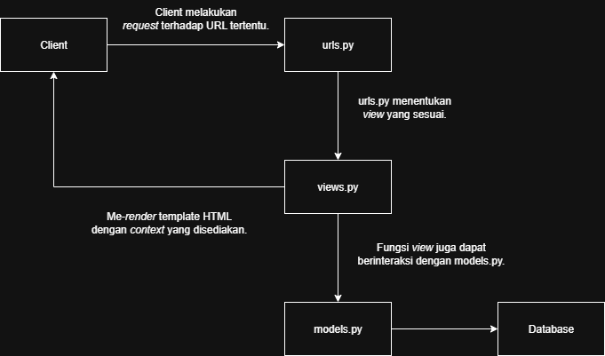

# ⚽ kick-street

A simple football marketplace made with Django.

# 🔗 Project URL
https://valerian-hizkia-footballnews.pbp.cs.ui.ac.id/

# ❓ Assignment 2 Questions

These are the answer for the questions given in assignment 2.

### Step-by-step implementation
1. Membuat proyek Django baru dan membuat aplikasi dengan nama ```main```

    Hal ini dilakukan dengan menggunakan ```django-admin startproject <nama projek> .``` dan dilanjutkan dengan ```python .\manage.py startapp <nama aplikasi>```. 
    
    Setelah itu menambahkan ```'main'``` pada array ```INSTALLED_APPS```.

2. Membuat model ```Product```

    Hal ini dilakukan dengan membuat sebuah class bernama ```Product``` dengan atribut-atribut sesuai dengan <i>field</i> yang diperlukan.

    Atribut-atribut ini menggunakan tipe data yang telah disediakan oleh Django sebelumnya (```django.db.models.Model```).

3. Membuat fungsi pada ```views.py```, membuat <i>template</i> HTML, melakukan <i>routing</i> pada ```urls.py```

    Dilakukan dengan membuat fungsi yang memanggil fungsi ```render()```. Fungsi ```render()``` ini nantinya akan dimasukkan beberapa argumen. Salah satunya adalah nama template HTML yang telah dibuat sebelumnya.

    Lalu mengimpor fungsi ini pada file ```urls.py```. Fungsi ini nantinya akan dimasukkan ke array```urlpatterns``` dengan satu dari tiga cara yang disediakan oleh Django.

    ```urls.py``` pada aplikasi ```main``` nantinya akan dihubungkan dengan ```urls.py``` pada direktori projek.

4. Deployment PWS

    Dilakukan dengan meng-<i>commit</i> kode ke <i>branch</i> ```master``` pada <i>remote repository</i> PWS.

### Request <i>flowchart</i>



### Fungsi ```settings.py```

File ini berfungsi sebagai konfigurasi untuk aplikasi Django. Memuat hal-hal seperti <i>allowed hosts</i>, konfigurasi <i>database</i>, konfigurasi <i>authentication</i> dan banyak hal lainnya.

### <i>Migration</i> pada Django

<i>Migration</i> pada Django dilakukan untuk memasukkan <i>field</i> yang telah ditentukan di ```models.py``` ke database. Hal ini membuat penyimpanan data dapat dilakukan.

### Why Django?

Django adalah <i>framework batteries included</i>. Seperti layaknya produk yang menyediakan baterai dari awal, Django telah menyediakan banyak hal. Seperti <i>authentication</i> dan <i>database</i>, sehingga <i>developer</i> tidak perlu mengkonfigurasi hal-hal tersebut dari awal.