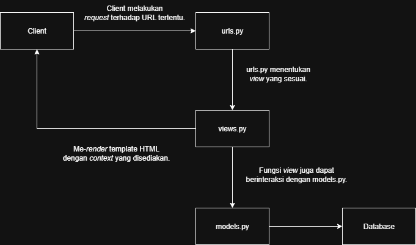
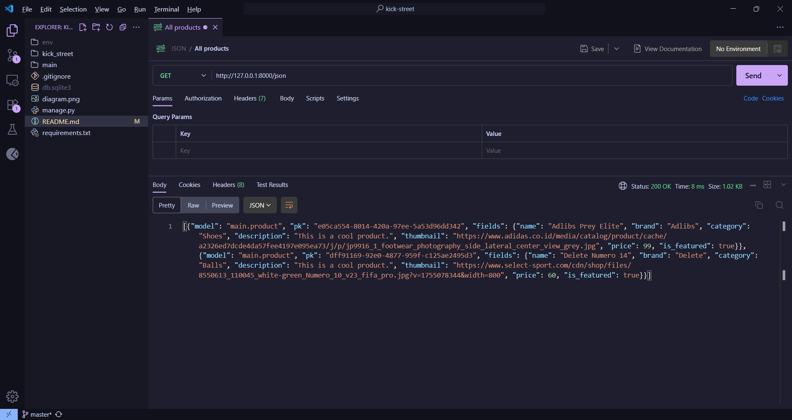
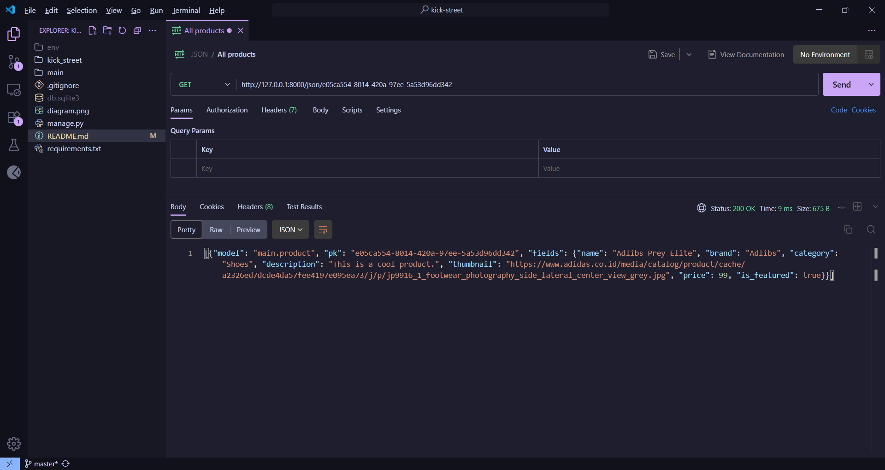
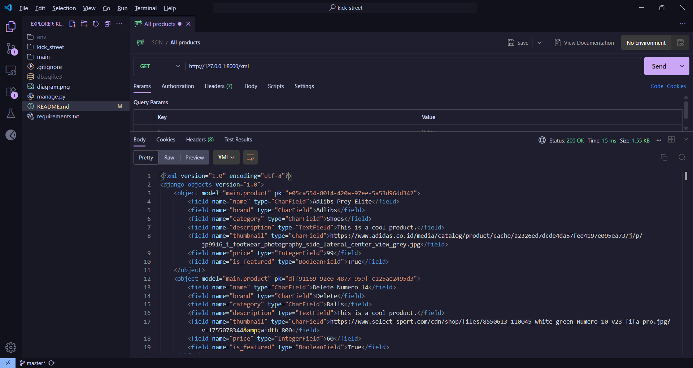
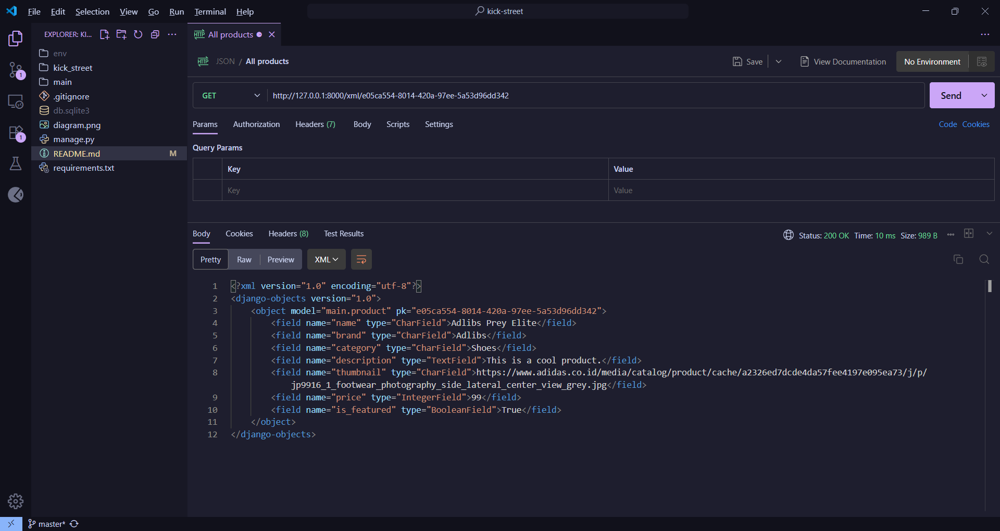

# ⚽ kick-street

A simple football marketplace made with Django.

# 🔗 Project URL
https://valerian-hizkia-footballnews.pbp.cs.ui.ac.id/

# ❓ Assignment 2 Questions

These are the answer for the questions given in assignment 2.

## Step-by-step implementation
1. Membuat proyek Django baru dan membuat aplikasi dengan nama ```main```

    Hal ini dilakukan dengan menggunakan ```django-admin startproject <nama projek> .``` dan dilanjutkan dengan ```python .\manage.py startapp <nama aplikasi>```. 
    
    Setelah itu menambahkan ```'main'``` pada array ```INSTALLED_APPS```.

2. Membuat model ```Product```

    Hal ini dilakukan dengan membuat sebuah class bernama ```Product``` dengan atribut-atribut sesuai dengan <i>field</i> yang diperlukan.

    Atribut-atribut ini menggunakan tipe data yang telah disediakan oleh Django sebelumnya (```django.db.models.Model```).

3. Membuat fungsi pada ```views.py```, membuat <i>template</i> HTML, melakukan <i>routing</i> pada ```urls.py```

    Dilakukan dengan membuat fungsi yang memanggil fungsi ```render()```. Fungsi ```render()``` ini nantinya akan dimasukkan beberapa argumen. Salah satunya adalah nama template HTML yang telah dibuat sebelumnya.

    Lalu mengimpor fungsi ini pada file ```urls.py```. Fungsi ini nantinya akan dimasukkan ke array```urlpatterns``` dengan satu dari tiga cara yang disediakan oleh Django.

    ```urls.py``` pada aplikasi ```main``` nantinya akan dihubungkan dengan ```urls.py``` pada direktori projek.

4. Deployment PWS

    Dilakukan dengan meng-<i>commit</i> kode ke <i>branch</i> ```master``` pada <i>remote repository</i> PWS.

## Request <i>diagram</i>



## Fungsi ```settings.py```

File ini berfungsi sebagai konfigurasi untuk aplikasi Django. Memuat hal-hal seperti <i>allowed hosts</i>, konfigurasi <i>database</i>, konfigurasi <i>authentication</i> dan banyak hal lainnya.

## <i>Migration</i> pada Django

<i>Migration</i> pada Django dilakukan untuk memasukkan <i>field</i> yang telah ditentukan di ```models.py``` ke database. Hal ini membuat penyimpanan data dapat dilakukan.

## Why Django?

Django adalah <i>framework batteries included</i>. Seperti layaknya produk yang menyediakan baterai dari awal, Django telah menyediakan banyak hal. Seperti <i>authentication</i> dan <i>database</i>, sehingga <i>developer</i> tidak perlu mengkonfigurasi hal-hal tersebut dari awal.

# ❓ Assignment 3 Questions

## Mengapa perlu <i>data delivery</i>?

Agar <i>client</i> dapat melakukan komunikasi dengan <i>server</i>. Komunikasi yang dimaksud ada banyak jenisnya. Misalnya melakukan <i>query</i> terhadap <i>database</i> dan melakukan autentikasi.

## JSON atau XML?

JSON lebih mudah untuk dianalisis dibandingkan dengan XML. Dikarenakan <i>format</i>-nya yang lebih simpel. JSON juga dapat di-<i>parse</i> dengan sangat mudah oleh JavaScript karena bentuknya yang mengikuti model objek di JavaScript. Dengan demikian saya memilih JSON dibandingkan dengan XML.

JSON
```json
{
  "products": [
    {
      "name": "shoes",
      "price": 99,
    },
  ],
}
```

XML
```xml
<?xml version="1.0"?>

<products>
  <product>
    <name>
      shoes
    </name>
    <price>
      99
    </price>
  </product>
</products>
```

## ```is_valid()```? ``````?

Fungsi ```is_valid()``` berfungsi untuk melakukan validasi pada <i>form</i> yang akan dikirim oleh pengguna. Hal ini memastikan bahwa <i>input</i> pengguna sesuai dengan yang diharapkan oleh <i>developer</i>.

Sedangkan `````` berfungsi untuk menghindari serangan <i>cross-site request forgery</i> (CSRF). 

Hal ini dilakukan dengan menaruh <i>cookie</i> CSRF pada <i>browser</i> pengguna. <i>cookie</i> ini nantinya akan dikirimkan bersamaan dengan <i>form</i> yang dikirim oleh pengguna. Jika tidak ada atau token tidak valid, akan dikirimkan status 403.

## Step-by-step implementation

## Postman

JSON - All Products


JSON - Product By Id


XML - ALL Products


XML - Product By Id


# ❓ Assignment 4 Questions

## AuthenticationForm?

```AuthenticationForm``` adalah sebuah form yang telah disediakan oleh Django itu sendiri. ```AuthenticationForm``` biasa digunakan untuk membuat form autentikasi. Dalam projek ini digunakan untuk <i>login</i>.

## Difference between authentication and authorization

Autentikasi adalah suatu proses menentukan apakah pengguna yang <i>login</i> adalah orang yang benar. Hal ini dilakukan dengan <i>session</i> dan <i>cookies</i>.

Autorisasi adalah suatu proses dimana sistem mengecek <i>permission</i> yang dimiliki oleh seorang pengguna. Hal ini dilakukan agar akses sebuah pengguna dibatasi.

## Kelebihan dan kekurangan session dan cookies

## Apakah cookie aman secara default?

## Step-by-step implementation
